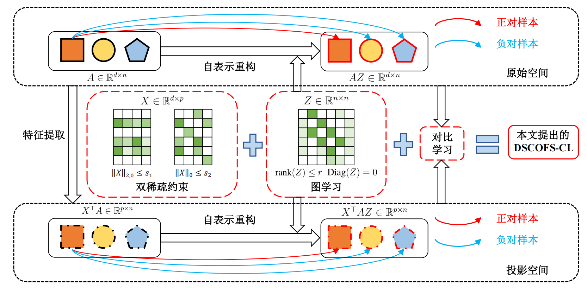

# DSCOFS-CL

The code in this toolbox implements "Unsupervised Feature Selection via Sparse and Low-Rank Contrastive Learning" by <i>X. Xiu, A. Yang, X. Li</i>.

### Testing
Directly run demo.py for reproduction.

### Citation
Please give credits to this paper if this code is useful and helpful for your research.
